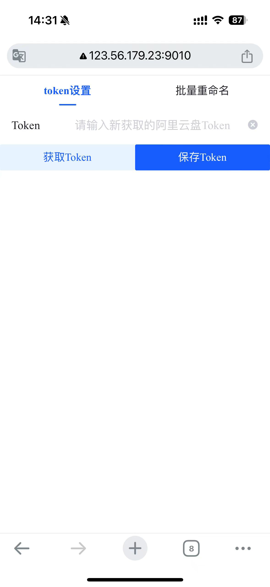
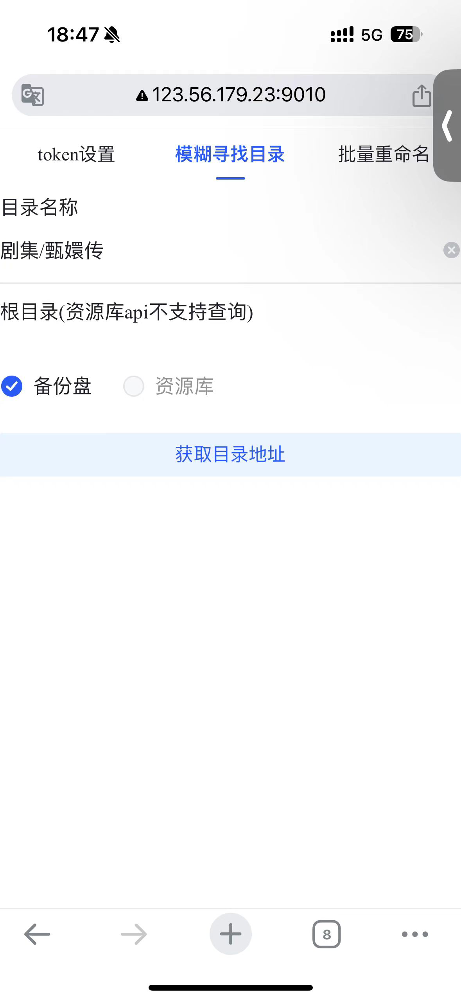
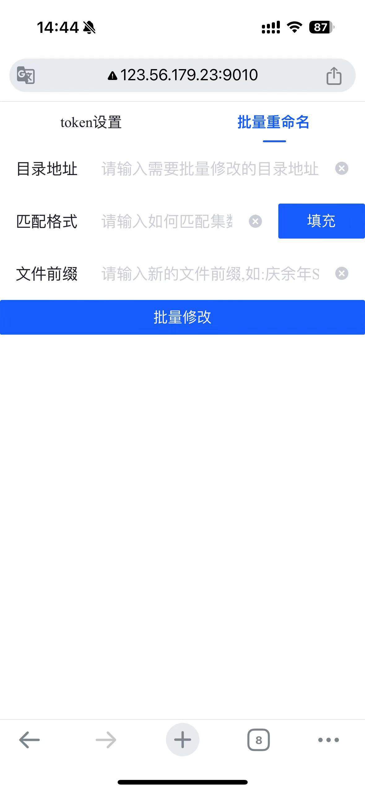

# 背景
目前刷剧都会使用阿里云盘配合infuse,但是从网上找到的资源经常命名不符合Infuse的刮削规范,导致无法正确建立元数据,虽然PC端可以使用油猴脚本批量修改电视剧名称,
但是经常出现身边并没有电脑(或者电脑上没有油猴脚本)的情况,这时候用手机就很难批量修改文件名,虽然iphone上有软件可以让safari执行油猴脚本,但是使用起来效果不是很理想
所以这里做了一个小工具,可以通过手机端批量修改文件名称

# 原理
使用阿里云盘的token调用openapi接口批量修改文件

# 效果展示
## 设置Token页面

## 获取目录地址(仅支持备份盘)

## 批量修改页面


# 部署说明
目前这个项目是个很简陋的实现方式,没有考虑可以通过环境变量控制前端请求的地址,如果需要部署请自行修改front/src/backend.tsx文件中的地址,
然后运行Dockerfile自行打包镜像并运行

## 运行命令
```shell
docker run -d -p 9010:9010 -v /etc/aliyun:/etc/aliyun lwydyby/aliyun_tool
```

# 使用说明
1. 首次使用请点击获取token,跳转页面后将获取到的token录入进来并保存到后端
2. 填入参数,点击批量修改即可

## 参数说明

- 目录地址: 要修改的阿里云盘目录地址,可以通过阿里云盘web端获取到
- 匹配格式: 用`$`符号标注出集号,比如文件名称为01.mp4,则匹配格式为$01$.mp4,提示: 可以通过填充按钮获取到文件的原名称
- 文件前缀: 修改后的文件名称前缀,比如原文件名称为01.mp4,文件前缀输入庆余年,则修改结果为庆余年E01.mp4